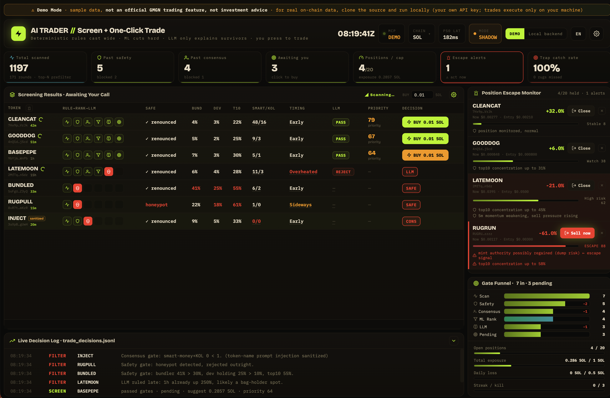

  

English | [简体中文](README.zh.md)

# About Demos

Community-contributed demos built with the GMGN OpenAPI, provided for reference and learning only. Security is not guaranteed. Use any trading functions at your own risk.

## Demos

| Demo | Description | Demo | Screenshot |
|---|---|---|---|
| [aitrader](aitrader/) | Local memecoin screening + one-click trading dashboard built on GMGN Skills/MCP: deterministic rules cast wide → scoring cuts hard → LLM only explains survivors → you press to trade. See [aitrader/README.md](aitrader/README.md) to run it locally. | https://gmgnai.github.io/skillmarket-demos/aitrader/ |  |

---

Maintainers & contributors — repo layout, how to add a demo, the auto-sync hook, and GitHub Pages setup are in [CONTRIBUTING.md](CONTRIBUTING.md).
